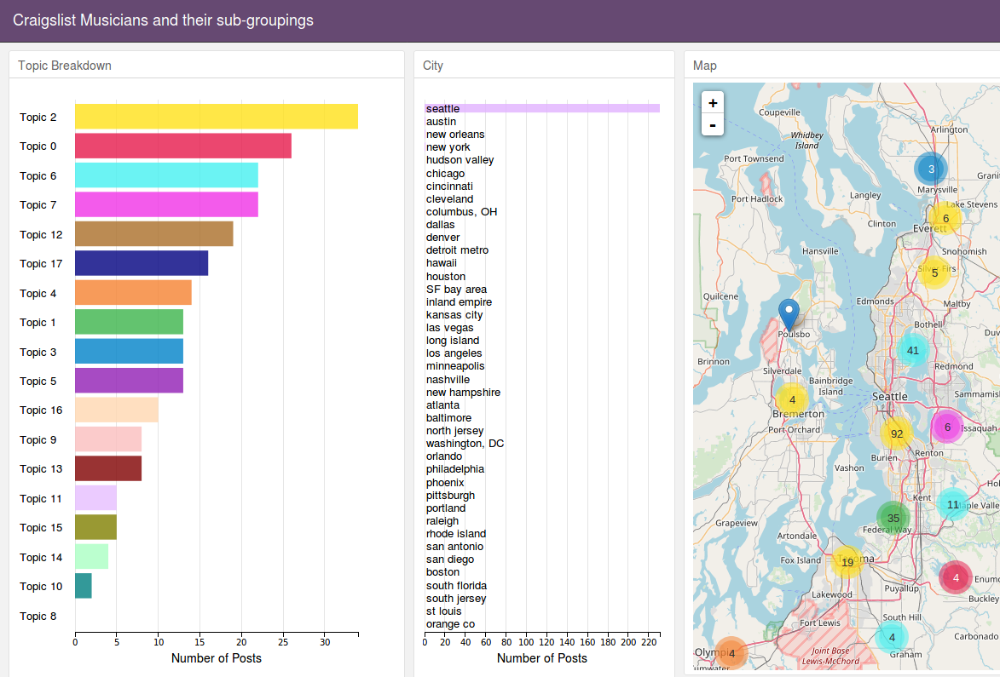

## Unsupervised Exploration of craigslist musicians communities in the United States.  
I scraped craigslist musicians sites with over 300 posts to get the text of each post. After preprocessing and text vectorization using tf-idf, I used non-negative matrix factorization (NMF) to model topics for the posts. The following files and folders are organized so that:
- **pres.pdf** contains my findings from data exploration and NMF
- **/notebooks** contains jupyter notebooks which demonstrate my workflow from preprocessing > modeling > visualization
- **app.py** is a Flask app I created to visualize the scraped posts according to their topics using an interactive leaflet map and dc.js libraries for charting. After cloning, run ```python app.py``` from the root to use the app which should then be running on 0.0.0.0:5000
The app looks like this:  

